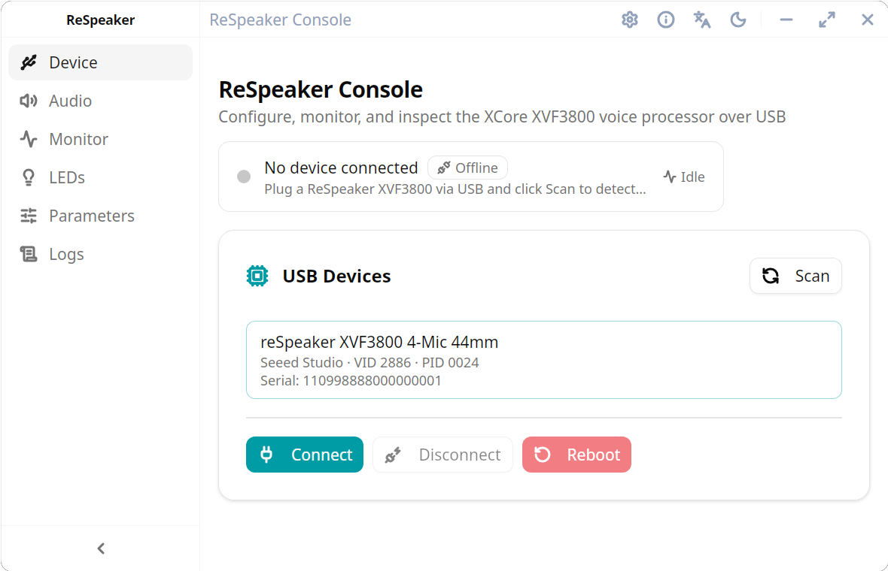

<div align="center">

# ReSpeaker Console

English | [简体中文](./README.zh-CN.md)

[](https://tauri.app/)
[](https://react.dev/)
[](https://www.typescriptlang.org/)
[](./LICENSE)

A desktop control application for ReSpeaker XVF3800 devices, built with Tauri v2, React 19, and TypeScript.

</div>

## Preview



## Overview

ReSpeaker Console is a cross-platform desktop application for configuring, monitoring, and diagnosing ReSpeaker XVF3800 hardware over USB. It turns the device command surface into a visual control panel so engineers, factory testers, and field support can complete common tasks without relying on ad-hoc scripts.

The current application follows a single-device connection model and focuses on practical operational workflows: connect to a device, inspect live status, adjust parameters, manage persistent configuration, export diagnostics, and handle updates.

## Features

- USB device discovery, selection, connection, disconnection, and reboot
- Real-time telemetry for DOA, VAD, RT60, AEC convergence, and beam energy
- Audio pipeline controls for microphone gain, reference gain, AGC, echo suppression, and limiter switches
- LED ring effect, brightness, speed, and color control
- Parameter catalog with search, read, write, export, import, save-to-flash, and restore-default flows
- In-app event logs with level filtering and export
- System tray integration and global shortcut support for quickly showing the main window
- Built-in updater flow backed by GitHub Releases
- English and Simplified Chinese UI
- Light and dark theme support

## Tech Stack

- **Desktop Framework**: [Tauri v2](https://tauri.app/)
- **Frontend Framework**: [React 19](https://react.dev/) + [TypeScript](https://www.typescriptlang.org/)
- **Build Tool**: [Vite](https://vite.dev/)
- **UI Components**: [shadcn/ui](https://ui.shadcn.com/)
- **Styling**: [Tailwind CSS v4](https://tailwindcss.com/)
- **Internationalization**: [i18next](https://www.i18next.com/)
- **Native Backend**: Rust + Tauri plugins + `rusb`

## Getting Started

### Prerequisites

- Node.js >= 18
- pnpm >= 9
- Rust >= 1.70

### Install Dependencies

```bash
pnpm install
```

### Development Mode

```bash
pnpm tauri:dev
```

### Build for Production

```bash
pnpm tauri:build
```

## License

MIT
