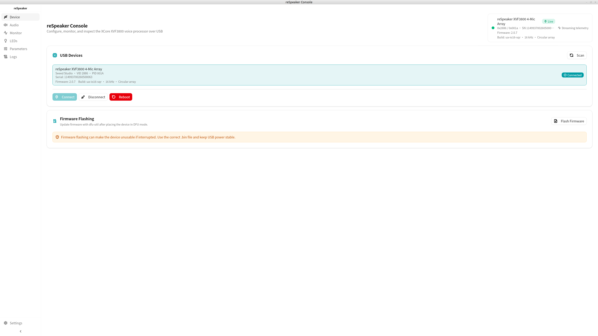
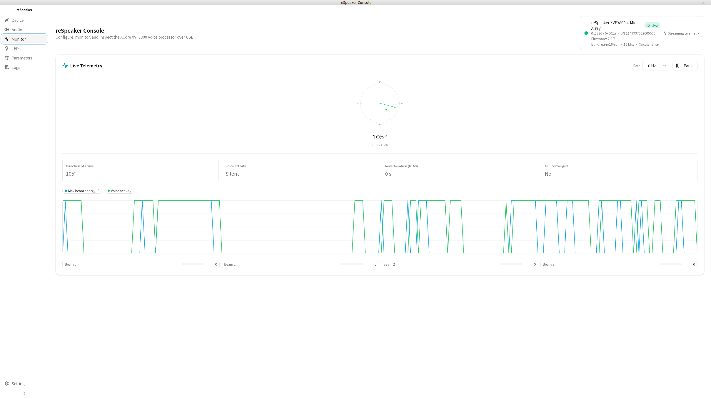
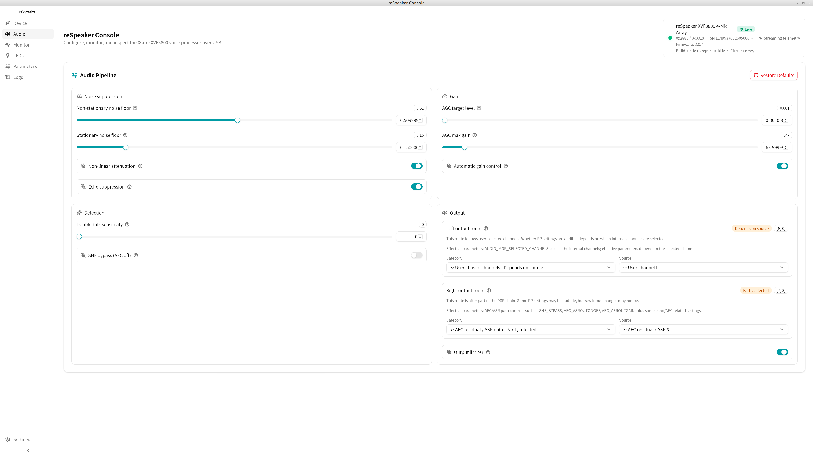
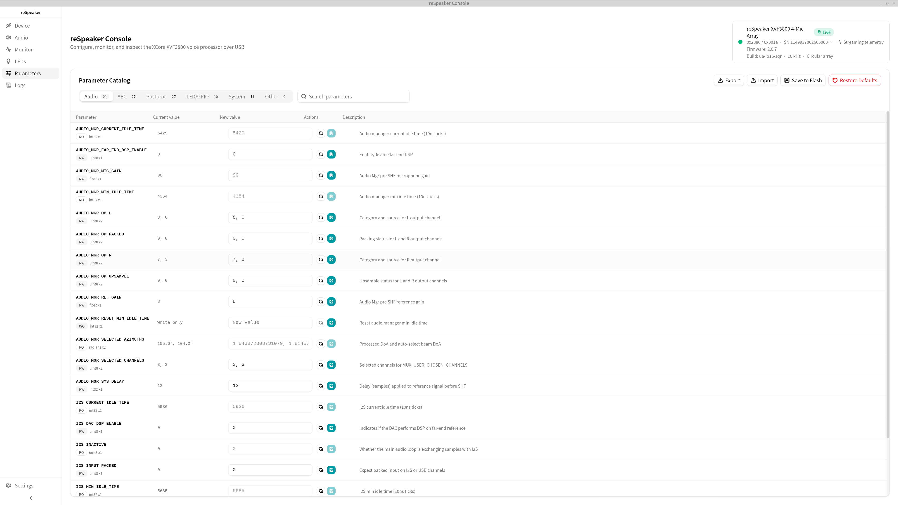
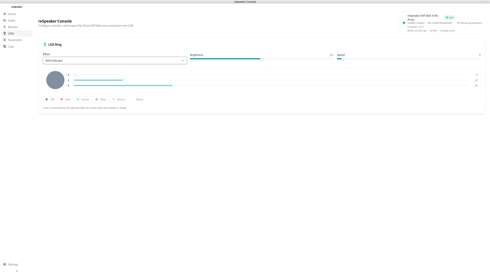
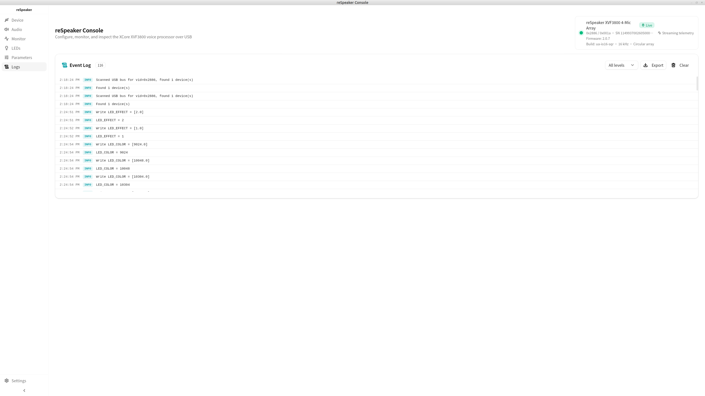

<div align="center">

<p align="center">
  
</p>

# reSpeaker Console

English | [简体中文](./README.zh-CN.md)

[](https://github.com/respeaker/respeaker-console/releases/latest)
[](https://github.com/respeaker/respeaker-console/releases/latest)
[](https://tauri.app/)
[](https://react.dev/)
[](https://www.typescriptlang.org/)
[](./LICENSE)

A desktop control application for reSpeaker XVF3800 devices, built with Tauri v2, React 19, and TypeScript.

</div>

## Overview

reSpeaker Console is a cross-platform desktop application for configuring, monitoring, and diagnosing reSpeaker XVF3800 devices. It brings USB device connection, live status, parameter management, firmware flashing, and diagnostic export workflows into one visual interface.

## Preview

<table>
  <tr>
    <th>Device Connection</th>
    <th>Live Monitoring</th>
    <th>Audio Control</th>
  </tr>
  <tr>
    <td></td>
    <td></td>
    <td></td>
  </tr>
  <tr>
    <th>Parameter Configuration</th>
    <th>LED Control</th>
    <th>Logs</th>
  </tr>
  <tr>
    <td></td>
    <td></td>
    <td></td>
  </tr>
</table>

## Features

- USB device discovery, selection, connection, disconnection, and reboot
- Real-time monitoring for DOA compass, VAD, RT60, AEC convergence, and beam energy
- Audio pipeline controls for microphone gain, reference gain, AGC, and echo-related switches
- LED ring effect, brightness, speed, and color control
- Parameter catalog with search, read, write, export, import, save-to-flash, and restore-default flows
- Firmware flashing through DFU (`dfu-util` is bundled on Windows; macOS/Linux require separate installation)
- In-app event logs with level filtering and export
- Tray menu and global shortcut support for quickly showing the main window
- Single-instance lock that focuses the existing window on repeated launch
- Built-in updater flow backed by GitHub Releases
- English and Simplified Chinese UI
- Light and dark theme support

## Download and Installation

Download the installer for your platform from the [Releases](https://github.com/respeaker/respeaker-console/releases/latest) page:

| Platform | Architecture  | Package Type            |
| -------- | ------------- | ----------------------- |
| Windows  | x64           | `.msi` / `.exe`         |
| macOS    | Apple Silicon | `.dmg` (aarch64)        |
| macOS    | Intel         | `.dmg` (x86_64)         |
| Linux    | x64           | `.deb` / `.AppImage`    |

### Windows: USB Driver Setup

Before first use, install the WinUSB driver for the device with [Zadig](https://zadig.akeo.ie/):

1. Download and run [Zadig](https://zadig.akeo.ie/)
2. Select `Options > List All Devices`
3. Select `reSpeaker 3800` or `reSpeaker XVF3800 4-Mic Array` from the device list
4. Select **WinUSB** as the driver, then click **Install Driver**
5. Unplug and reconnect the device, then run `dfu-util -l` to confirm that it is detected

> `dfu-util.exe` is bundled with the application and does not need to be installed separately.

### macOS: Install dfu-util

Install `dfu-util` before using the firmware flashing feature:

```bash
brew install dfu-util
```

### Linux: Install dfu-util and Configure USB Permissions

```bash
sudo apt install dfu-util
```

USB access also requires a udev rule. Create `/etc/udev/rules.d/99-respeaker.rules`:

```
SUBSYSTEM=="usb", ATTRS{idVendor}=="2886", MODE="0666", GROUP="plugdev"
```

Then reload the rules and reconnect the device:

```bash
sudo udevadm control --reload-rules && sudo udevadm trigger
```

## Build from Source

### Prerequisites

- Node.js >= 18
- pnpm >= 9
- Rust >= 1.70

### Install Dependencies

```bash
pnpm install
```

### Development Mode

```bash
pnpm tauri:dev
```

### Build for Production

```bash
pnpm tauri:build
```

## Tech Stack

| Layer             | Technology                    |
| ----------------- | ----------------------------- |
| Desktop Framework | Tauri v2                      |
| Frontend          | React 19 + TypeScript         |
| Build Tool        | Vite                          |
| UI Components     | shadcn/ui                     |
| Styling           | Tailwind CSS v4               |
| i18n              | i18next                       |
| Native Backend    | Rust + Tauri plugins + `rusb` |

## License

MIT
